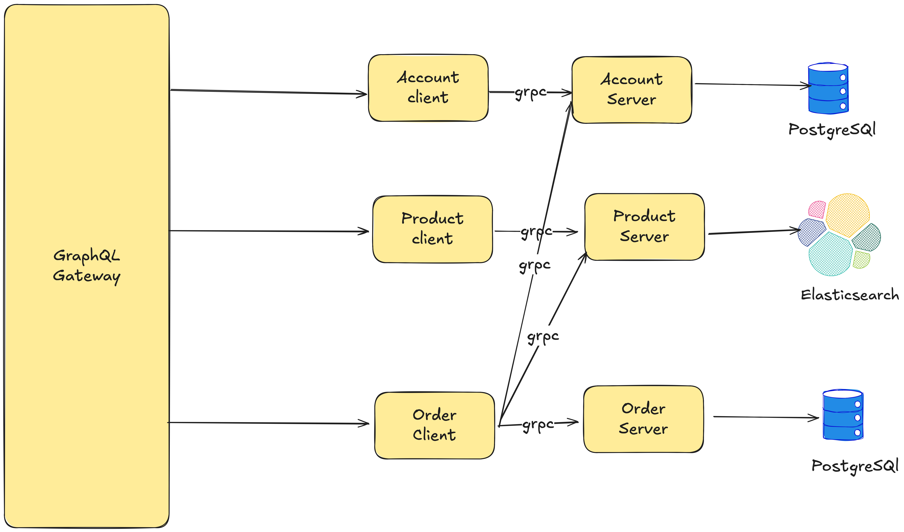

# GoCore - Microservices E-commerce Platform

A microservices-based e-commerce platform built with Go, gRPC, GraphQL, PostgreSQL, and Elasticsearch.

## Architecture


```


## Services

- **GraphQL Gateway**: Single entry point for all API requests
- **Account Service**: Manages user accounts (PostgreSQL)
- **Product Service**: Manages product catalog (Elasticsearch)
- **Order Service**: Manages orders and order history (PostgreSQL)

## Prerequisites

- Go 1.24+
- Docker & Docker Compose
- Protocol Buffers compiler (`protoc`)
- Go protobuf plugins

## Installation

### 1. Install Protocol Buffers

```bash
# macOS
brew install protobuf

# Ubuntu/Debian
sudo apt-get install protobuf-compiler

# Windows
# Download from https://github.com/protocolbuffers/protobuf/releases
```

### 2. Install Go Protobuf Plugins

```bash
go install google.golang.org/protobuf/cmd/protoc-gen-go@latest
go install google.golang.org/grpc/cmd/protoc-gen-go-grpc@latest
```

### 3. Install gqlgen

```bash
go install github.com/99designs/gqlgen@latest
```

## Setup

### 1. Clone the Repository

```bash
git clone https://github.com/sdshah09/GoCore.git
cd GoCore
```

### 2. Generate Protocol Buffers

```bash
# Generate account service protobuf
cd account
protoc --go_out=pb --go_opt=paths=source_relative \
       --go-grpc_out=pb --go-grpc_opt=paths=source_relative \
       account.proto

# Generate product service protobuf
cd ../product
protoc --go_out=pb --go_opt=paths=source_relative \
       --go-grpc_out=pb --go-grpc_opt=paths=source_relative \
       product.proto

# Generate order service protobuf
cd ../order
protoc --go_out=pb --go_opt=paths=source_relative \
       --go-grpc_out=pb --go-grpc_opt=paths=source_relative \
       order.proto
```

### 3. Generate GraphQL Code

```bash
cd ../graphql
go run github.com/99designs/gqlgen generate
```

### 4. Start Services with Docker Compose

```bash
cd ..
docker-compose up -d
```

## Running Locally

### Start All Services

```bash
# Start all services and databases
docker-compose up -d

# Check service status
docker-compose ps
```

### Stop All Services

```bash
docker-compose down
```

### View Logs

```bash
# View all logs
docker-compose logs

# View specific service logs
docker-compose logs graphql
docker-compose logs account
docker-compose logs product
docker-compose logs order
```

## API Endpoints

- **GraphQL Playground**: http://localhost:8080/playground
- **GraphQL Endpoint**: http://localhost:8080/graphql

## GraphQL Queries and Mutations

### Mutations

#### 1. Create Account

```graphql
mutation CreateAccount {
  createAccount(account: {
    name: "John Doe"
  }) {
    id
    name
  }
}
```

#### 2. Create Product

```graphql
mutation CreateProduct {
  createProduct(product: {
    name: "iPhone 15 Pro"
    description: "Latest iPhone with advanced camera system"
    price: 999.99
  }) {
    id
    name
    description
    price
  }
}
```

#### 3. Create Order

```graphql
mutation CreateOrder {
  createOrder(order: {
    accountId: "account-123"
    products: [
      {
        id: "product-456"
        quantity: 2
      },
      {
        id: "product-789"
        quantity: 1
      }
    ]
  }) {
    id
    createdAt
    totalPrice
    products {
      id
      name
      description
      price
      quantity
    }
  }
}
```

### Queries

#### 1. Get All Accounts

```graphql
query GetAllAccounts {
  accounts {
    id
    name
    orders {
      id
      createdAt
      totalPrice
    }
  }
}
```

#### 2. Get Accounts with Pagination

```graphql
query GetAccountsWithPagination {
  accounts(pagination: {
    skip: 0
    take: 10
  }) {
    id
    name
  }
}
```

#### 3. Get Account by ID

```graphql
query GetAccountById {
  accounts(id: "account-123") {
    id
    name
    orders {
      id
      createdAt
      totalPrice
      products {
        id
        name
        price
        quantity
      }
    }
  }
}
```

#### 4. Get All Products

```graphql
query GetAllProducts {
  products {
    id
    name
    description
    price
  }
}
```

#### 5. Search Products

```graphql
query SearchProducts {
  products(query: "iPhone") {
    id
    name
    description
    price
  }
}
```

#### 6. Get Products with Pagination

```graphql
query GetProductsWithPagination {
  products(pagination: {
    skip: 0
    take: 5
  }) {
    id
    name
    description
    price
  }
}
```

#### 7. Get Product by ID

```graphql
query GetProductById {
  products(id: "product-456") {
    id
    name
    description
    price
  }
}
```

#### 8. Get Orders for Account

```graphql
query GetOrdersForAccount {
  ordersForAccount(accountId: "account-123") {
    id
    createdAt
    totalPrice
    products {
      id
      name
      description
      price
      quantity
    }
  }
}
```

## Database Schema

### PostgreSQL (Account & Order Services)

#### Accounts Table
```sql
CREATE TABLE accounts (
    id CHAR(27) PRIMARY KEY,
    name VARCHAR(255) NOT NULL
);
```

#### Orders Table
```sql
CREATE TABLE orders (
    id CHAR(27) PRIMARY KEY,
    created_at TIMESTAMP WITH TIME ZONE NOT NULL,
    account_id CHAR(27) NOT NULL,
    total_price MONEY NOT NULL
);
```

#### Order Products Table
```sql
CREATE TABLE order_products (
    order_id CHAR(27) REFERENCES orders (id) ON DELETE CASCADE,
    product_id CHAR(27),
    quantity INT NOT NULL,
    PRIMARY KEY (product_id, order_id)
);
```

### Elasticsearch (Product Service)

Products are stored in Elasticsearch with the following structure:
```json
{
  "id": "product-123",
  "name": "iPhone 15 Pro",
  "description": "Latest iPhone with advanced camera system",
  "price": 999.99
}
```

## Development

### Project Structure

```
GoCore/
├── account/           # Account service
│   ├── cmd/
│   ├── pb/           # Generated protobuf files
│   ├── repository.go
│   ├── service.go
│   ├── server.go
│   └── account.proto
├── product/          # Product service
│   ├── cmd/
│   ├── pb/
│   ├── repository.go
│   ├── service.go
│   ├── server.go
│   └── product.proto
├── order/            # Order service
│   ├── cmd/
│   ├── pb/
│   ├── repository.go
│   ├── service.go
│   ├── server.go
│   └── order.proto
├── graphql/          # GraphQL gateway
│   ├── schema.graphql
│   ├── mutation_resolver.go
│   ├── query_resolver.go
│   └── main.go
├── docker-compose.yml
├── go.mod
└── README.md
```

### Adding New Services

1. Create service directory with `cmd/`, `pb/`, `repository.go`, `service.go`, `server.go`
2. Define protobuf schema in `.proto` file
3. Generate protobuf code
4. Add service to `docker-compose.yml`
5. Update GraphQL schema if needed

### Testing

```bash
# Test individual services
cd account && go test ./...
cd ../product && go test ./...
cd ../order && go test ./...

# Test GraphQL queries
# Use the GraphQL Playground at http://localhost:8080/playground
```

## Troubleshooting

### Common Issues

1. **Port conflicts**: Stop local PostgreSQL/Elasticsearch instances
2. **Protobuf generation errors**: Ensure `protoc` and plugins are installed
3. **GraphQL generation errors**: Run `go mod tidy` and ensure gqlgen is installed
4. **Docker build failures**: Check Dockerfile paths and dependencies

### Debugging

```bash
# Check service logs
docker-compose logs [service-name]

# Access service containers
docker-compose exec [service-name] sh

# Check database connections
docker-compose exec account_db psql -U akhil -d akhil
docker-compose exec order_db psql -U akhil -d akhil

# Check Elasticsearch
curl http://localhost:9200/_cluster/health
```

## Contributing

1. Fork the repository
2. Create a feature branch
3. Make your changes
4. Add tests if applicable
5. Submit a pull request

